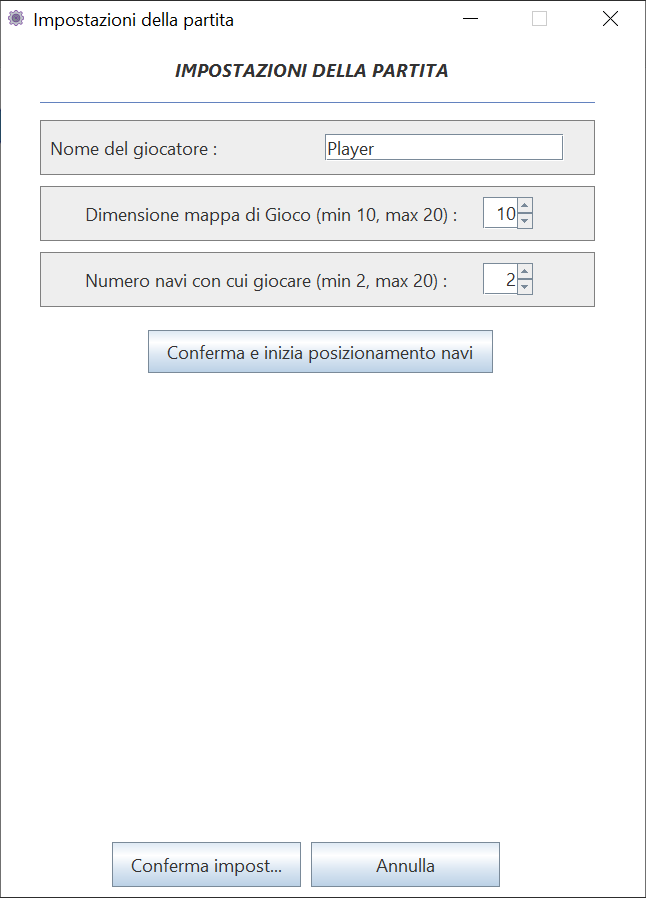
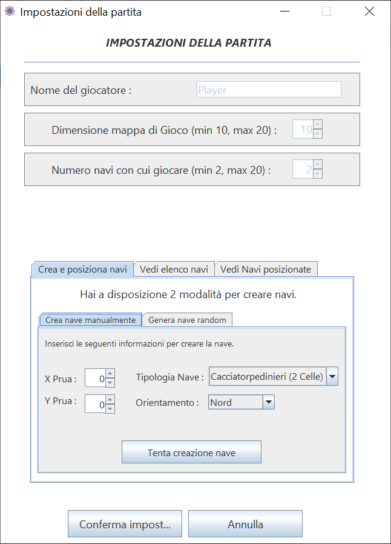
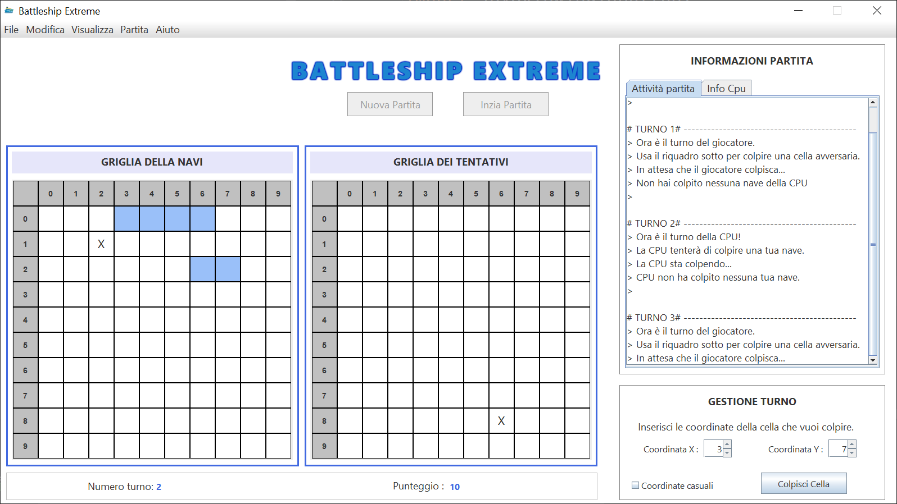
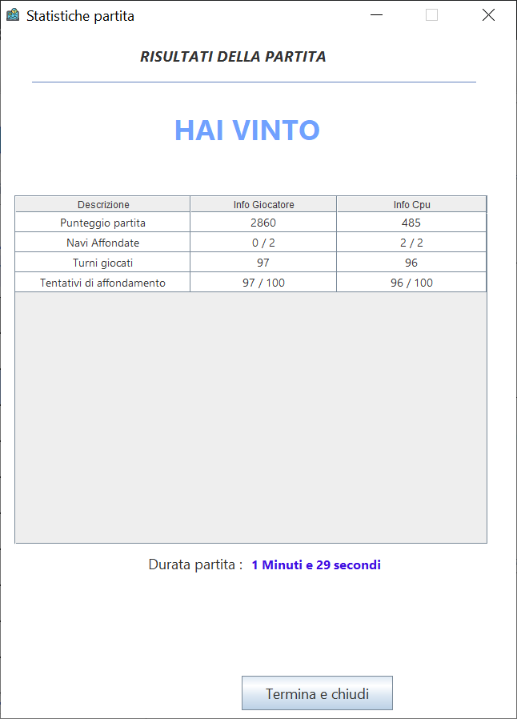

# Battleship_Extreme
BattleshipExtreme non è altro che una versione semplificata del famoso gioco “Battaglia Navale". 

## Informazioni generali
Lo sviluppo di questa applicazione è nato come progetto di laboratorio del corso di Ingegneria del software, presso l'Università Del Piemonte Orientale.

Il gioco è interamente sviluppato con Java 11 e SWING.

## Installazione
Basta clonare la repository e importare il progetto in un IDE. Per avviarlo usare il JRE/JDK 11.

## Screenshots
Lascio qua sotto alcuni screen del gioco.

